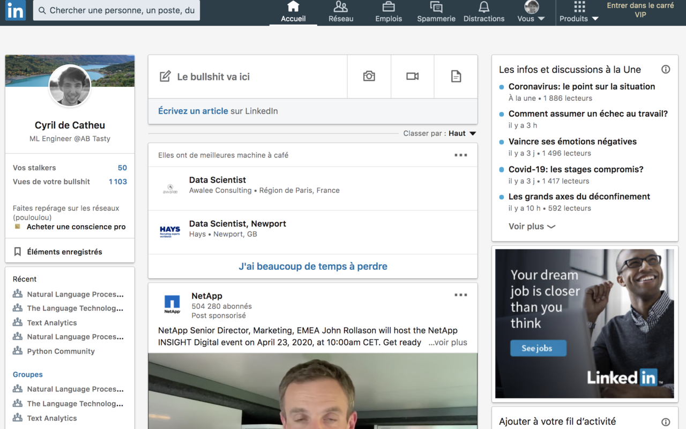

# linkedin-mieux
(Chrome extension for the french linkedin) 

Linkedin en mieux. 
Vocabulaire et descriptions revisitées pour toujours plus de productivité sur le réseau.
Extension chrome pour un linkedin meilleur, que dis-je un futur meilleur.    
Inspiré et forké de [they-linkedin](https://github.com/prichey/they-linkedin), en mieux. 

## Installation

- Sur le [Chrome Store](https://chrome.google.com/webstore/detail/linkedin-mieux/apdkgcdgjcjmkgihhglddlepeahpecad/) 
- En téléchargement direct:
    1. Télécharger le [package](https://github.com/cyrilou242/linkedin-mieux/blob/master/linkedin-mieux.zip?raw=true) et décompresser 
    2. Aller dans Chrome -> [Extensions](chrome://extensions/)
    3. Charger l'extension non empaquetée

## Permissions
Nécessite `webRequest` pour observer les calls AJAX. Toutes les manipulations sont faites dans le DOM.
L'extension ne fait pas de requêtes.

### hihi

